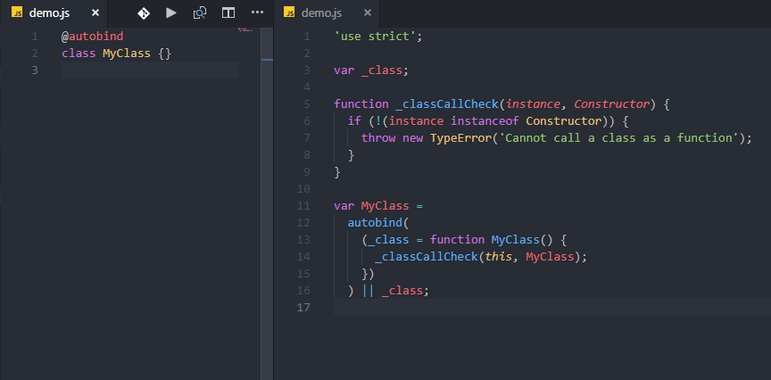
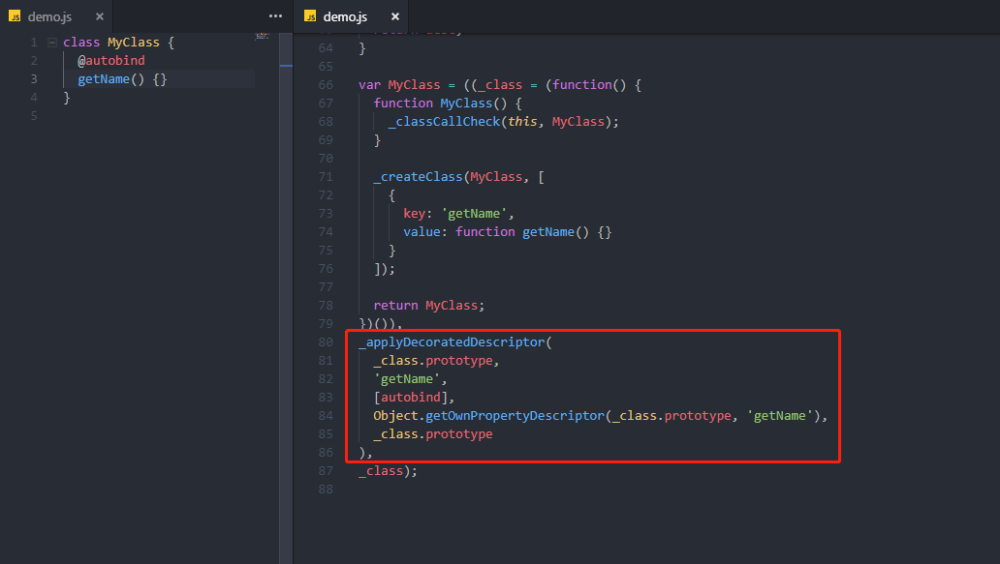
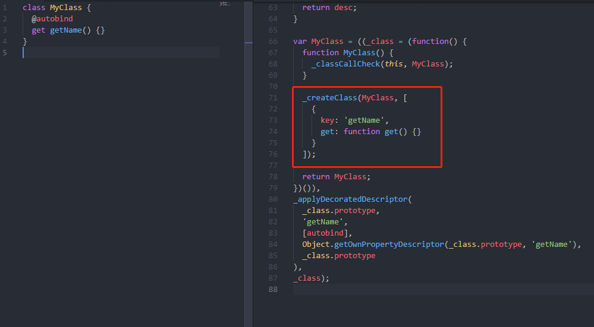
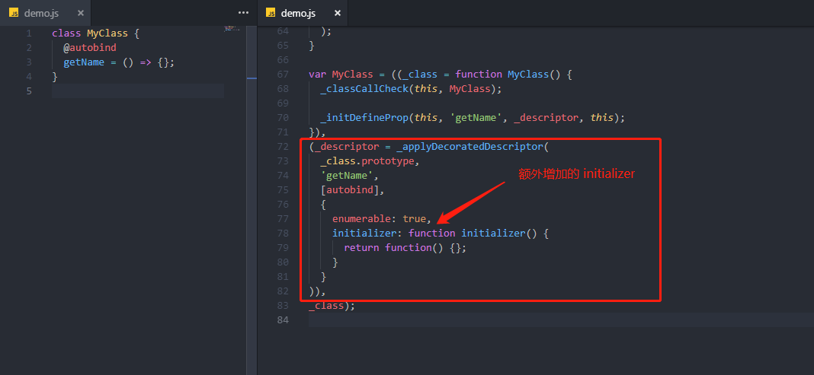
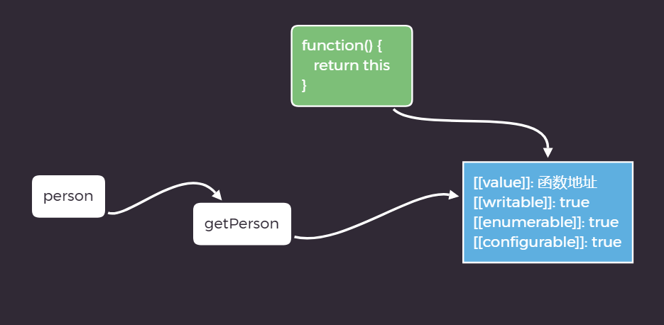
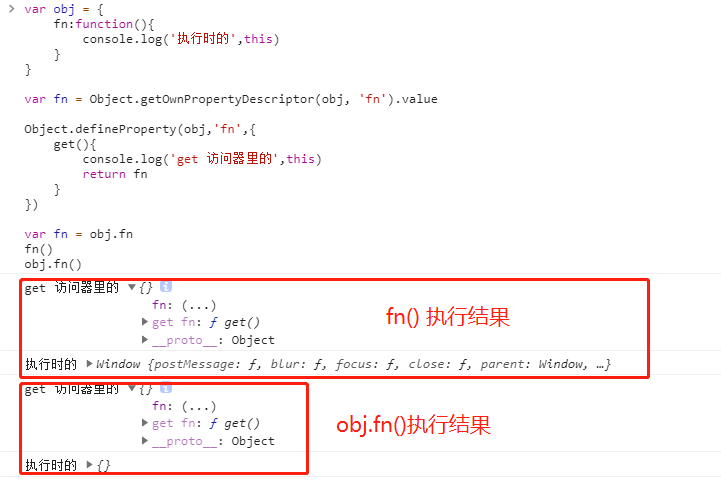

# Decorators

[Decorators](https://github.com/wycats/javascript-decorators) 目前处于[提案阶段](https://github.com/tc39/proposals)，可通过 `babel` 或 `TS` 编译使用。
本文分为三部分：

- Decorators 基本概念
- Babel 与 Decorators
- TypeScript 与 Decorators

## 基本概念

> 装饰器 (Decorators) 让你可以在设计时对类和类的属性进行注解和修改。

`Decorators` 接受目标对象、名称和装饰器描述作为参数，可选地返回一个装饰器描述来安装到目标对象上，其的函数签名为 `function(target, key?, descriptor?)`。

`Decorators` 的本质是利用了 ES5 的 [`Object.defineProperty`](https://developer.mozilla.org/zh-CN/docs/Web/JavaScript/Reference/Global_Objects/Object/defineProperty) 方法

### `Object.defineProperty`

> `Object.defineProperty()` 方法会直接在一个对象上定义一个新属性，或者修改一个对象的现有属性， 并返回这个对象。

`Object.defineProperty(obj, prop, descriptor)`

- `obj` 要在其上定义属性的对象。

- `prop` 要定义或修改的属性的名称。

- `descriptor` 将被定义或修改的属性描述符。

- `返回值` 被传递给函数的对象。

其中 `descriptor` 可通过 [`Object.getOwnPropertyDescriptor()`](https://developer.mozilla.org/zh-CN/docs/Web/JavaScript/Reference/Global_Objects/Object/getOwnPropertyDescriptor) 方法获得。

### `Object.getOwnPropertyDescriptor`

> `Object.getOwnPropertyDescriptor()` 方法返回指定对象上一个自有属性对应的属性描述符。（自有属性指的是直接赋予该对象的属性，不需要从原型链上进行查找的属性）

- `obj` 需要查找的目标对象

- `prop` 目标对象内属性名称（String 类型）

- `返回值` 如果指定的属性存在于对象上，则返回其属性描述符对象（property descriptor），否则返回 `undefined`。

### Descriptor

> 一个属性描述符是一个记录，由下面属性当中的某些组成的：

- `value` 该属性的值(仅针对数据属性描述符有效)

- `writable` 当且仅当属性的值可以被改变时为 `true`。(仅针对数据属性描述有效)

- `configurable` 当且仅当指定对象的属性描述可以被改变或者属性可被删除时，为 `true`。

- `enumerable` 当且仅当指定对象的属性可以被枚举出时，为 `true`。

- `get` 获取该属性的访问器函数（`getter`）。如果没有访问器， 该值为 `undefined`。(仅针对包含访问器或设置器的属性描述有效)

- `set` 获取该属性的设置器函数（`setter`）。 如果没有设置器， 该值为 `undefined`。(仅针对包含访问器或设置器的属性描述有效)

## babel 与 Decorators

现阶段官方说有 2 种装饰器，但从实际使用上来看是有 4 种，分别是：

- 作用于 `class` 上的 “**类装饰器**”。

- 作用于属性上的 “**属性装饰器**”，这需要配合另一个的类属性语法提案，或者作用于对象字面量。

- 作用于方法上的 “**方法装饰器**”。

- 作用于 `getter` 或 `setter` 上的 “**访问器装饰器**”。

下面我们通过 babel ，来感受一下各装饰器：

### babel 配置

先简单介绍下 babel 的用法：

1. 全局安装 `babel`

```bash
npm i -g babel
```

2. 配置 `.babelrc`

```json
{
  "presets": [["es2015", { "modules": false }]],
  // transform-decorators-legacy 用于支持 `decorators`
  // transform-class-properties 用于支持 类属性
  "plugins": ["transform-decorators-legacy", "transform-class-properties"],
  "env": {
    "development": {
      "plugins": ["transform-es2015-modules-commonjs"]
    }
  }
}
```

3. 在 `package.json` 配置 npm script

```json
{
  "babel": "babel ./demo/demo.js -w --out-dir dist"
}
```

该命令的意思是：监听 `demo` 目录下 `demo.js` 文件，并将编译结果输出到 `dist` 目录

下面列出各装饰器在 `babel` 编译后对应的输出结果。

### “类装饰器”



从编译后的结果可以看到，`autobind` 作为装饰器只接受了一个参数，也就是类本身(构造函数)。

```js
class MyClass = {}
MyClass = autobind(MyClass) || MyClass
```

### “方法装饰器”



bebel 对于`方法装饰器`的处理会比较特别，下面看下核心处理：

```js
var _class;

// 1、首先，初始化一个 class
var initClass = (_class = (function() {
  // ... 类定义
})());

// 2、通过 `_applyDecoratedDescriptor` 方法使用传入的装饰器对 `_class.prototype` 中的方法进行装饰处理。
var Decorator = _applyDecoratedDescriptor(
  _class.prototype,
  'getName',
  [autobind],
  Object.getOwnPropertyDescriptor(_class.prototype, 'getName'),
  _class.prototype
);

// 3、利用逗号操作符的作用，返回装饰完的 `_class`
var MyClass = (initClass, Decorator, _class);
```

后续会对 `_applyDecoratedDescriptor` 方法进一步讲解。

> **逗号操作符** 对它的每个操作数求值（从左到右），并返回最后一个操作数的值。

### “访问器装饰器”



“访问器装饰器” 的处理方式与 “方法装饰器”类似。

### “属性装饰器”



区别在于传入的第三个参数 `Descriptor` 并不是由 `Object.getOwnPropertyDescriptor(_class.prototype, 'getName')` 返回的，并且多了一个 `Descriptor` 并不存在的 `initializer` 属性供`_applyDecoratedDescriptor` 方法使用。

```js
_applyDecoratedDescriptor(
  _class.prototype,
  'getName',
  [autobind],
  // Object.getOwnPropertyDescriptor(_class.prototype, 'getName'),
  {
    enumerable: true,
    initializer: function initializer() {
      return function() {};
    }
  }
))
```

接下来就让我们来看一下 `_applyDecoratedDescriptor` 都做了哪些事

### `_applyDecoratedDescriptor`

`_applyDecoratedDescriptor` 其实是对 `decorator` 的一个封装，用于处理多种情况。其接受的参数跟 `decorator` 大体一致。

- `target` 目标对象

- `property` 属性名称

- `descriptor` 属性描述对象

- `decorators` 装饰器函数 (数组，表示可传入多个装饰器)

- `context` 上下文

- `返回值` 属性描述对象

```js
function _applyDecoratedDescriptor(
  target,
  property,
  decorators,
  descriptor,
  context
) {
  // 1、通过传入参数 `descriptor` 初始化最终导出的 `属性描述对象`
  var desc = {};
  Object['ke' + 'ys'](descriptor).forEach(function(key) {
    desc[key] = descriptor[key];
  });
  desc.enumerable = !!desc.enumerable;
  desc.configurable = !!desc.configurable;

  // 2、存在 `value` 或者 class 初始化属性 则将 `writable` 设置为 `true`
  if ('value' in desc || desc.initializer) {
    desc.writable = true;
  }

  // 3、处理传入的 decorator 函数
  // 其中 `reverse` 保证了，当同一个方法有多个装饰器，会由内向外执行。
  desc = decorators
    .slice()
    .reverse()
    .reduce(function(desc, decorator) {
      return decorator(target, property, desc) || desc;
    }, desc);

  // 看 babel 编译后的代码，当 `initializer` 不为 `undefined` 时，并不会传入 `context`
  // 笔者看不懂! ??? 这是一个永远不会执行的逻辑... 难道改走 `_initDefineProp` 逻辑了?
  if (context && desc.initializer !== void 0) {
    desc.value = desc.initializer ? desc.initializer.call(context) : void 0;
    desc.initializer = undefined;
  }

  // 4. 使用 Object.defineProperty 对 `target` 对象的 `property` 属性赋值为 `desc`
  if (desc.initializer === void 0) {
    Object['define' + 'Property'](target, property, desc);
    desc = null;
  }

  return desc;
}
```

> **void 运算符** 对给定的表达式进行求值，然后返回 `undefined`。

现在我们对 `Descorators` 有了大致的了解，接下来看下 **Descorators 基于 babel 编译下的装饰器**

### 自动绑定 `this`

我们先来看一个关于 `this` 的问题

### `this` 的指向问题

```js
class Person {
  getPerson() {
    return this;
  }
}

let person = new Person();
const { getPerson } = person;

getPerson() === person; // false
person.getPerson() === person; // true
```

这段代码中，`getPerson` 和 `person.getPerson` 指向同一个函数且返回 `this` ，但它们的执行结果却不一样。

`this` 指的是函数运行时所在的环境：

- `getPerson()` 运行在全局环境，所以 `this` 指向全局环境

- `person.getPerson` 运行在 `person` 环境，所以 `this` 指向 `person`

关于 `this` 的原理可以参考 [这篇](http://www.ruanyifeng.com/blog/2018/06/javascript-this.html)：

在本例中，`getPerson()` 是一个函数，JavaScript 引擎会将函数单独保存在内存中，然后再将函数的地址赋值给 `getPerson` 属性的 `value` 属性 ([descriptor](https://developer.mozilla.org/en-US/docs/Web/JavaScript/Reference/Global_Objects/Object/getOwnPropertyDescriptor))



由于函数单独存在于内存中，所以它可以在不同的环境 (上下文) 执行。

来看个例子：

```js
// 注意，这里都是用 var 声明变量

var name = 'globalName';

var fn = function() {
  console.log(this.name);
  return this.name;
};

var person = {
  getPerson: fn,
  name: 'personName'
};

// 单独执行
var ref = person.getPerson;
ref();

// or
fn();

// person 环境指执行
person.getPerson();
```

函数可以在不同的运行环境 ([context](http://flippinawesome.org/2013/08/26/understanding-scope-and-context-in-javascript/))，所以需要一种机制，能够在函数体内部获得当前的运行环境。

这里 `this` 的设计目的就是在函数体内部，指代函数当前的运行环境。

例子中，`fn()` 和 `ref()` 的运行环境都是 **全局运行环境** 而 `person.getPerson()` 的运行环境是 `person`，因此得到了不同的 `this`

解决 `this` 指向的方法有很多种，比如函数的原型方法

- [bind](https://developer.mozilla.org/zh-CN/docs/Web/JavaScript/Reference/Global_Objects/Function/bind)
- [call](https://developer.mozilla.org/zh-CN/docs/Web/JavaScript/Reference/Global_Objects/Function/call)
- [apply](https://developer.mozilla.org/zh-CN/docs/Web/JavaScript/Reference/Global_Objects/Function/apply)
- [箭头函数](https://developer.mozilla.org/zh-CN/docs/Web/JavaScript/Reference/Functions/Arrow_functions) ( 建议结合 [函数表达式](https://developer.mozilla.org/zh-CN/docs/Web/JavaScript/Reference/Operators/function) 一起了解 )

通过上面学习到的知识，接着来讲解 `Decorator` 中如何实现 `autobind` 给函数或类自动绑定 `this`

### autobind 实现逻辑

一、 首先来看下 **如何给类的方法自动绑定 `this`**：

1. 开始前，先来运行下面这段代码：

```js
var obj = {
  fn: function() {
    console.log('执行时的', this);
  }
};

var fn = Object.getOwnPropertyDescriptor(obj, 'fn').value;

Object.defineProperty(obj, 'fn', {
  get() {
    console.log('get 访问器里的', this);
    return fn;
  }
});

var fn = obj.fn;
fn();
obj.fn();
```



2. 可以得到的一个结论：`get(){}` 访问器属性里面的 `this` 始终指向 `obj` 这个对象。

3. 如果简化逻辑，也就是不考虑其他特殊情况下，`autobindMethod` 应该是这样的：

```js
function autobindMethod(target, key, { value: fn, configurable, enumerable }) {
  return {
    configurable,
    enumerable,
    get() {
      const boundFn = fn.bind(this);
      defineProperty(this, key, {
        configurable: true,
        writable: true,
        enumerable: false,
        value: boundFn
      });
      return boundFn;
    },
    set: createDefaultSetter(key)
  };
}
```

> **bind()** 方法创建一个**新的函数**， 当这个新函数被调用时 this 键值为其提供的值，其参数列表前几项值为创建时指定的参数序列。

有了 `autobind` 这个装饰器，`getName` 方法的 `this` 就始终指向实例对象本身了。

```js
class TestGet {
  @autobind
  getName() {
    console.log(this);
  }
}
```

二、接着来看下类的 `autobind` 实

对类绑定 `this` 其实就是为了批量给类的实例方法绑定 `this` 所以只要获取所有实例方法，再调用 `autobindMethod` 即可。

```js
function autobindClass(klass) {
  const descs = getOwnPropertyDescriptors(klass.prototype);
  const keys = getOwnKeys(descs);

  for (let i = 0, l = keys.length; i < l; i++) {
    const key = keys[i];
    const desc = descs[key];

    if (typeof desc.value !== 'function' || key === 'constructor') {
      continue;
    }

    defineProperty(
      klass.prototype,
      key,
      autobindMethod(klass.prototype, key, desc)
    );
  }
}
```

## TypeScript 与 Decorators

## 参考

- [lodash-decorators](https://github.com/steelsojka/lodash-decorators#readme)
- [core-decorators](https://github.com/jayphelps/core-decorators)
